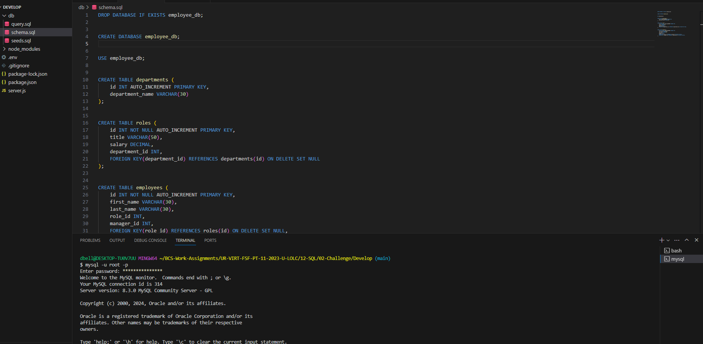

# employee_tracker

##Description

This is an employee tracker application. This application allows you to vew 3 different tables in the employee database. A user can view all employees, view all roles, view all departments, add new departments, add new employees, and add new roles for those employees.

To access, copy the repository in github, then use the git clone function in command line to clone this repository into your local machine.

##Usage

Screenshot

Link below:

https://github.com/devbelle/employee_tracker

##Credits

All commits and changes to this assignment were implemented by Devin Belle

##License

N/A

##Features

This employess trackers includes inquirer vers 8.2.4 for the question prompts and requires the user to have Node.js installed. Application also uses mysql2 for pulling up the tables.

##Tests

Run Node.js to receive the message prompts.
